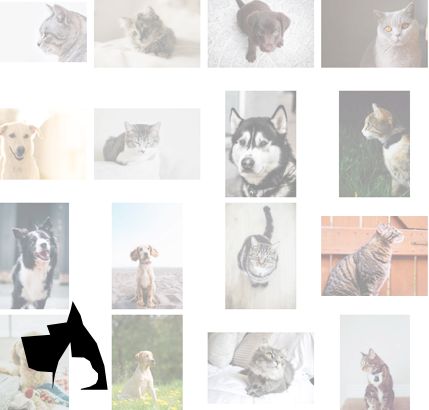
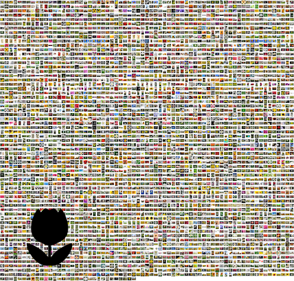

## Create ML Playgrounds

Xcode playgrounds for training, evaluating machine learning models.

Written by [krishna](https://blackwaterparkstudios.com).

CreateML Playgrounds need OS X Mojave.

### 📹 Demo Video

Training image classifiers is as easy as creating sticker packs. Just drag and drop images. 

See the video - [How to Train & Test Image Classifier Using Create ML Playgrounds](dog-cat-classifier-demo.mp4)

### Playgrounds

- [image-classifier](image-classifier.playground)

- [Movie Review Sentiment Classifier](movie-review-sentiment-classifier.playground)

### Trained Models

- [DogCatClassifier](models/DogCatClassifier.mlmodel) (Accuracy - 100%, Training Time - ~1 second, Size - 17 KB)
- [FruitClassifier](models/FruitClassifier.mlmodel) (Accuracy - TBD,Training Time - 35 minutes, Size - 1.1 MB)
- [movie-review-sentiment-classifier](models/movie-review-sentiment.mlmodel) (Accuracy - 99%,Training Time - 15 seconds, Size - 774 KB)

- [chest-xray-pneumonia-classifier](models/ChestXrayPneumoniaClassifier.mlmodel) (Accuracy - 93%,Training Time - 6 minutes, Size - 20 KB)

- [flower-classifier](models/FlowerClassifier.mlmodel) (Accuracy - 93%,Training Time - 4 minutes, Size - 70 KB)

Training Machine - Mac Pro 6-core with 64 GB RAM, dual AMD D700s.

### Datasets

- [Chest X-Ray Images (Pneumonia) 5,863 images (Source: Kaggle)][aaef79c3]
- [A dataset with 65 fruits and 43329 images (Source: Kaggle)][dab38c66]
- [Flowers Dataset with 4242 images (Source: Kaggle)][d2561765]
- [movie-review-data training](datasets/train-movie-reviews.zip)
- [movie-review-data test](datasets/test-movie-reviews.zip)
- [dog-cat-data](datasets/dog-cat-data.zip)

### References

- [WWDC 2018 Session 703 - Introducing Create ML][66033728]
- [Create ML : Apple Developer][d8f80357]

  [d8f80357]: https://developer.apple.com/documentation/create_ml "Create ML : Apple Developer"

  [66033728]: https://developer.apple.com/videos/play/wwdc2018/703/ "WWDC 2018 Session 703 - Introducing Create ML"
  [dab38c66]: https://www.kaggle.com/moltean/fruits "A dataset with 65 fruits and 43329 images (Source: Kaggle)"
  [aaef79c3]: https://www.kaggle.com/paultimothymooney/chest-xray-pneumonia "Chest X-Ray Images (Pneumonia) 5,863 images (Source: Kaggle)"
  [d2561765]: https://www.kaggle.com/alxmamaev/flowers-recognition "Flowers Dataset from Kaggle (4242 images)"
