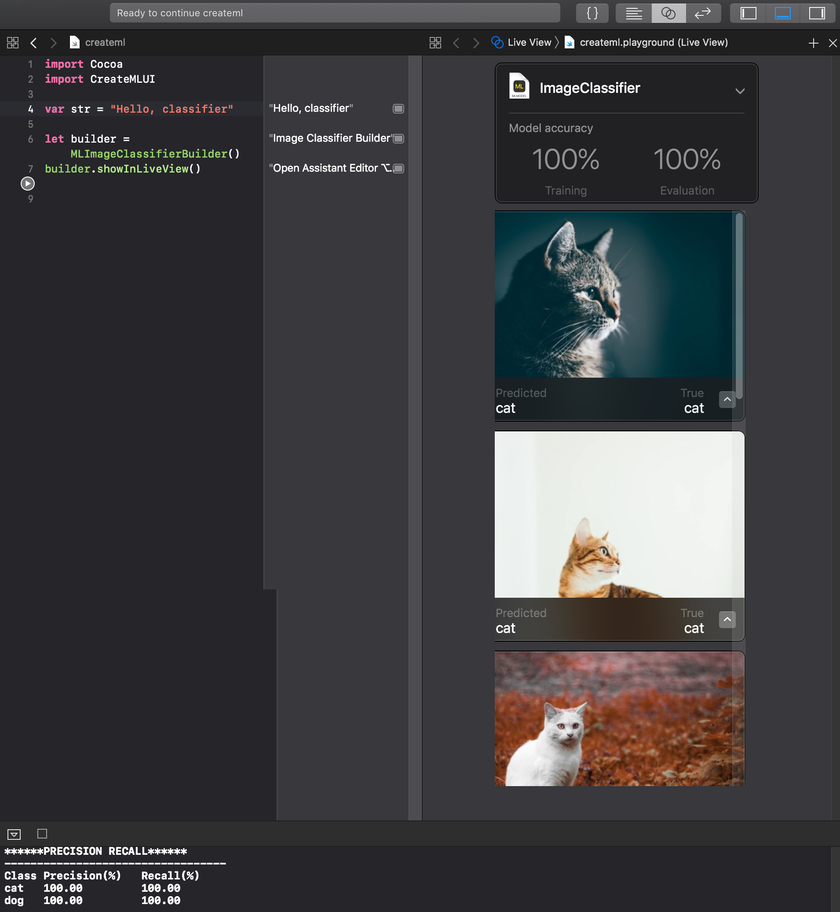

## Create ML Playgrounds

CreateML Playgrounds need OS X Mojave.

[Demo Video - How to Traing & Test Using Create ML Playgrounds](dog-cat-classifier-demo.mp4)

- [dog-cat-classifier](dog-cat-classifier.playground)

### Training Data

- [dog-cat-data](dog-cat-data.zip)

### References

- macOS Mojave
- [Create ML : Apple Developer][d8f80357]

  [d8f80357]: https://developer.apple.com/documentation/create_ml "Create ML : Apple Developer"
