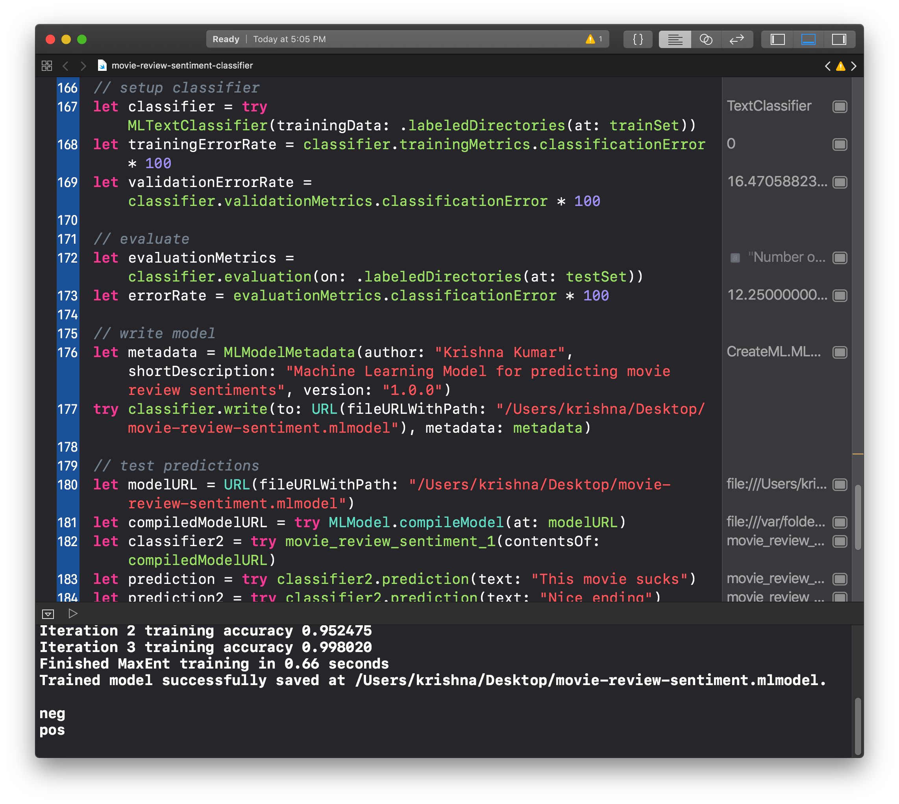

## Create ML Playgrounds

CreateML Playgrounds need OS X Mojave.

[Demo Video - How to Traing & Test Images Using Create ML Playgrounds](dog-cat-classifier-demo.mp4)

1.  [dog-cat-classifier](dog-cat-classifier.playground)

2. [Movie Review Sentiment Classifier](movie-review-sentiment-classifier.playground)

### Training Data

- [movie-review-data training](train-movie-reviews.zip)
- [movie-review-data test](test-movie-reviews.zip)
- [dog-cat-data](dog-cat-data.zip)

### References

- [WWDC 2018 Session 703 - Introducing Create ML][66033728]
- [Create ML : Apple Developer][d8f80357]
- [Movie Review Data provided by Cornell University Computer Science Department][e3c1bb59]
- [Image data provided by Unsplash][d6a78dfa]

  [d8f80357]: https://developer.apple.com/documentation/create_ml "Create ML : Apple Developer"

  [e3c1bb59]: http://www.cs.cornell.edu/people/pabo/movie-review-data/ "Movie Review Data provided by Cornell University Computer Science Department"
  [d6a78dfa]: https://unsplash.com/ "Image data provided by Unsplash"
  [66033728]: https://developer.apple.com/videos/play/wwdc2018/703/ "WWDC 2018 Session 703 - Introducing Create ML"
